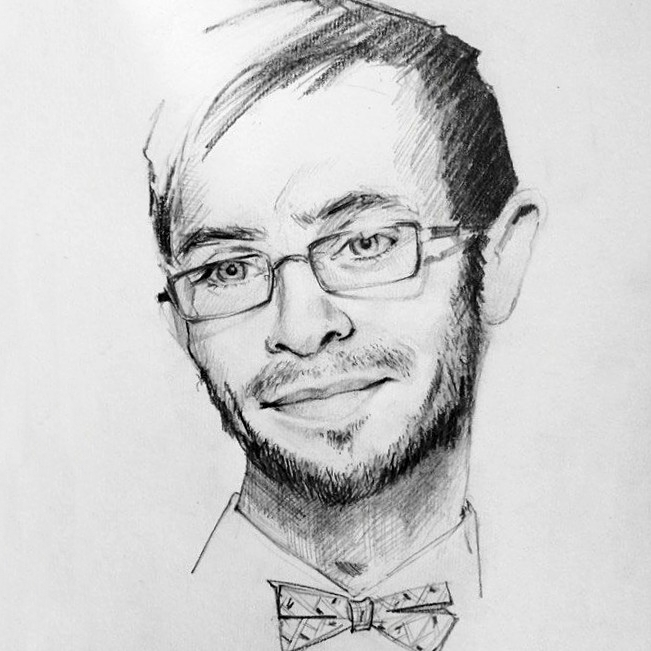

<html lang="en-US">
    <head>
        <meta charset="UTF-8" />
        <meta name="viewport" content="width=device-width, initial-scale=1.0">
        <meta name="author" content="Andrey Kirillov">
        <link rel="stylesheet" type="text/css" href="main.css" media="all">
        <link rel="icon" type="image/png" href="AK.png" />
        <title>Andrey Kirillov &nbsp; - &nbsp; Home</title>
        <link href="https://fonts.googleapis.com/css2?family=Raleway&display=swap" rel="stylesheet">
        <link href="https://fonts.googleapis.com/css2?family=Literata&display=swap" rel="stylesheet">
    </head>
<body>
   

       

           <ul class="tabbed">
               <li><a href="https://andykirillov.github.io/index.html">About</a></li>
               <li><a href="https://andykirillov.github.io/research.html">Research</a></li>
               <li><a href="https://andykirillov.github.io/contact.html">Contact</a></li>
               <li><a href="https://andykirillov.github.io/cv.html">CV</a></li>
           </ul>
       

          
       
         
       <h1>Andrey Kirillov</h1>         
        
       <h2>Samara University of Public Administration “International Market Institute” Germanic Languages Department</h2>
       <h3>Director of M.A. Program in Linguistics</h3>
         
       <p.noindent>I am an Associate Professor at the Germanic Languages Department and Director of M.A. Program in Linguistics at the International Market Institute, Samara (Russia).

       <p.noindent>My research focus is on political and media linguistics, online discourse. As a teacher, I am responsible for a range of undergraduate and graduate classes, including English, Introduction to Linguistics, General Linguistics, Media Linguistics, Sociolinguistics.

       <p.noindent>I am also an editor-in-chief of an independent online academic journal “Language. Text. Society” (ISSN 2687-0487), which co-hosts an international conference (LTS-Con).

    
 
</body>
</html>

